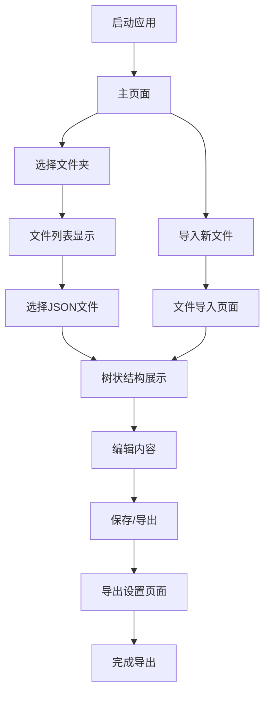

# JSON文件编辑器产品需求文档

## 1. Product Overview
本产品是一个本地运行的JSON文件编辑器，支持多层级JSON文件的可视化编辑和管理。
- 解决JSON文件编辑复杂、容易出错的问题，为开发者和数据管理人员提供直观的JSON编辑工具。
- 目标用户包括前端开发者、后端开发者、数据分析师等需要频繁处理JSON文件的专业人员。

## 2. Core Features

### 2.1 User Roles
本产品为单用户本地应用，无需用户角色区分。

### 2.2 Feature Module
我们的JSON编辑器需求包含以下主要页面：
1. **主页面**：文件管理区域、JSON树状展示区域、编辑操作区域
2. **文件导入页面**：文件选择界面、导入预览
3. **导出设置页面**：导出格式选择、文件保存位置设置

### 2.3 Page Details

| Page Name | Module Name | Feature description |
|-----------|-------------|---------------------|
| 主页面 | 文件管理区域 | 显示当前文件夹内所有JSON文件列表，支持文件选择和切换 |
| 主页面 | JSON树状展示区域 | 以树状结构展示JSON内容，支持展开/折叠各层级，显示键值对类型 |
| 主页面 | 编辑操作区域 | 提供添加、删除、修改节点功能，实时预览编辑结果 |
| 主页面 | 工具栏 | 包含导入、导出、保存、撤销、重做等操作按钮 |
| 文件导入页面 | 文件选择器 | 支持选择本地JSON文件，显示文件基本信息 |
| 文件导入页面 | 导入预览 | 预览待导入JSON文件的结构和内容 |
| 导出设置页面 | 格式选择 | 选择导出格式（保持原格式、压缩格式、美化格式） |
| 导出设置页面 | 保存位置 | 选择文件保存路径和文件名 |

## 3. Core Process

主要用户操作流程：
1. 启动应用 → 自动打开浏览器显示主界面
2. 选择文件夹 → 扫描并显示所有JSON文件
3. 选择JSON文件 → 以树状结构展示内容
4. 编辑JSON内容 → 实时更新树状显示
5. 保存或导出 → 保持原始格式输出文件

## 4. User Interface Design

### 4.1 Design Style
- 主色调：深蓝色 (#2563eb)，辅助色：浅灰色 (#f8fafc)
- 按钮样式：圆角矩形，悬停效果，阴影设计
- 字体：系统默认字体，代码区域使用等宽字体 (Consolas, Monaco)
- 布局风格：左侧文件树 + 右侧编辑区域的分栏布局
- 图标风格：线性图标，简洁现代

### 4.2 Page Design Overview

| Page Name | Module Name | UI Elements |
|-----------|-------------|-------------|
| 主页面 | 文件管理区域 | 左侧边栏，文件夹图标，文件列表，搜索框 |
| 主页面 | JSON树状展示区域 | 中央区域，可展开/折叠的树节点，不同类型的图标标识 |
| 主页面 | 编辑操作区域 | 右侧面板，表单输入框，类型选择器，操作按钮 |
| 主页面 | 工具栏 | 顶部横向布局，图标按钮，分组显示 |
| 文件导入页面 | 文件选择器 | 模态对话框，拖拽上传区域，文件信息显示 |
| 导出设置页面 | 格式选择 | 单选按钮组，格式预览区域 |

### 4.3 Responsiveness
桌面优先设计，支持最小宽度1024px的显示器，暂不考虑移动端适配。