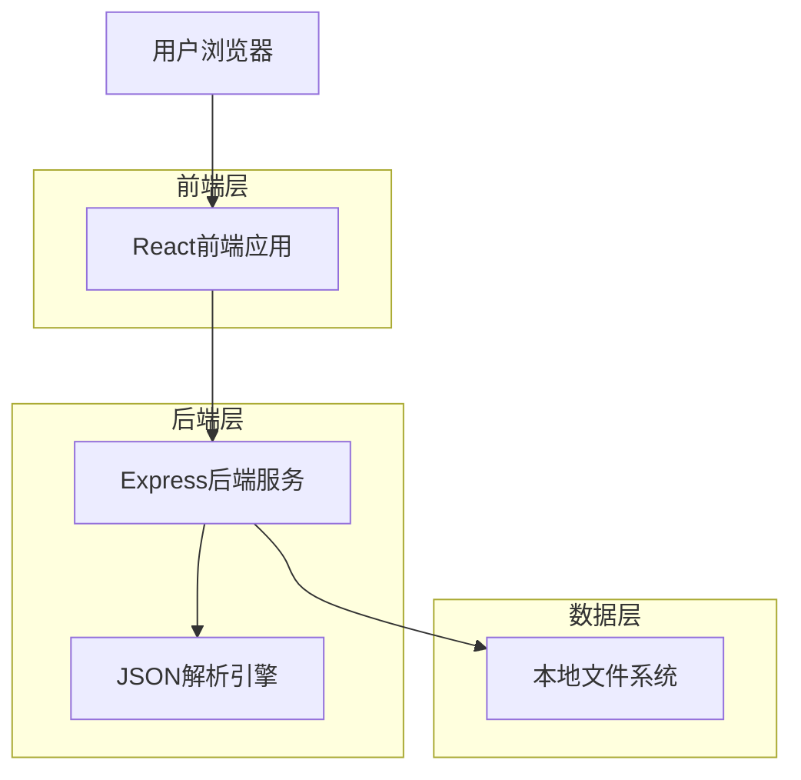
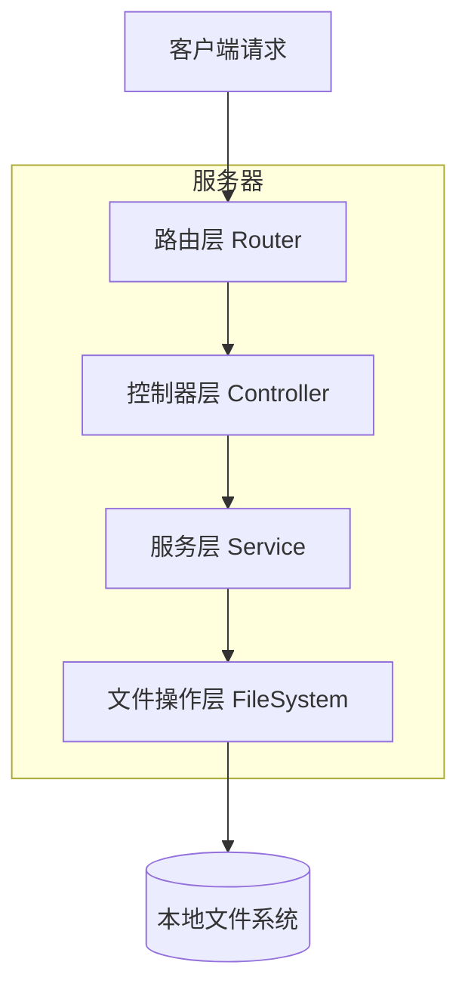
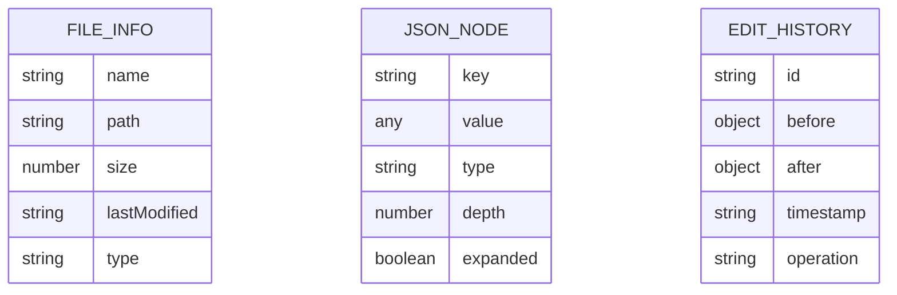

# JSON编辑器技术架构文档

## 1. Architecture design



## 2. Technology Description

* Frontend: React\@18 + TypeScript\@5 + Tailwind CSS\@3 + Vite\@5

* Backend: Express\@4 + TypeScript\@5 + Multer\@1 (文件上传)

* 工具库: fs-extra\@11 (文件操作), chokidar\@3 (文件监听)

## 3. Route definitions

| Route   | Purpose          |
| ------- | ---------------- |
| /       | 主页面，显示JSON编辑器界面  |
| /import | 文件导入页面，处理文件上传和预览 |
| /export | 导出设置页面，配置导出选项    |

## 4. API definitions

### 4.1 Core API

文件管理相关

```
GET /api/files
```

Response:

| Param Name | Param Type      | Description  |
| ---------- | --------------- | ------------ |
| files      | Array<FileInfo> | 文件夹内JSON文件列表 |
| success    | boolean         | 请求状态         |

Example

```json
{
  "files": [
    {
      "name": "config.json",
      "path": "/path/to/config.json",
      "size": 1024,
      "lastModified": "2024-01-01T00:00:00Z"
    }
  ],
  "success": true
}
```

JSON文件读取

```
GET /api/files/:filename
```

Response:

| Param Name | Param Type | Description |
| ---------- | ---------- | ----------- |
| content    | object     | JSON文件内容    |
| metadata   | object     | 文件元数据信息     |

JSON文件保存

```
POST /api/files/:filename
```

Request:

| Param Name     | Param Type | isRequired | Description |
| -------------- | ---------- | ---------- | ----------- |
| content        | object     | true       | 修改后的JSON内容  |
| preserveFormat | boolean    | false      | 是否保持原始格式    |

Response:

| Param Name | Param Type | Description |
| ---------- | ---------- | ----------- |
| success    | boolean    | 保存状态        |
| message    | string     | 操作结果信息      |

文件导入

```
POST /api/import
```

Request: FormData with file

Response:

| Param Name | Param Type | Description |
| ---------- | ---------- | ----------- |
| content    | object     | 解析后的JSON内容  |
| filename   | string     | 文件名         |
| success    | boolean    | 导入状态        |

文件导出

```
POST /api/export
```

Request:

| Param Name | Param Type | isRequired | Description                    |
| ---------- | ---------- | ---------- | ------------------------------ |
| content    | object     | true       | 要导出的JSON内容                     |
| format     | string     | false      | 导出格式 (pretty/compact/original) |
| filename   | string     | true       | 导出文件名                          |

Response: File download

## 5. Server architecture diagram



## 6. Data model

### 6.1 Data model definition



### 6.2 Data Definition Language

由于使用本地文件系统，无需数据库DDL。主要数据结构定义如下：

文件信息接口

```typescript
interface FileInfo {
  name: string;
  path: string;
  size: number;
  lastModified: string;
  type: 'file' | 'directory';
}
```

JSON节点接口

```typescript
interface JsonNode {
  key: string;
  value: any;
  type: 'string' | 'number' | 'boolean' | 'object' | 'array' | 'null';
  depth: number;
  expanded: boolean;
  parent?: string;
  children?: JsonNode[];
}
```

编辑历史接口

```typescript
interface EditHistory {
  id: string;
  before: any;
  after: any;
  timestamp: string;
  operation: 'add' | 'edit' | 'delete' | 'move';
  path: string[];
}
```

应
